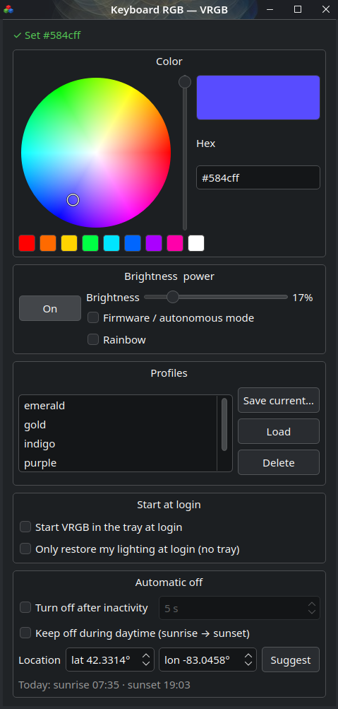
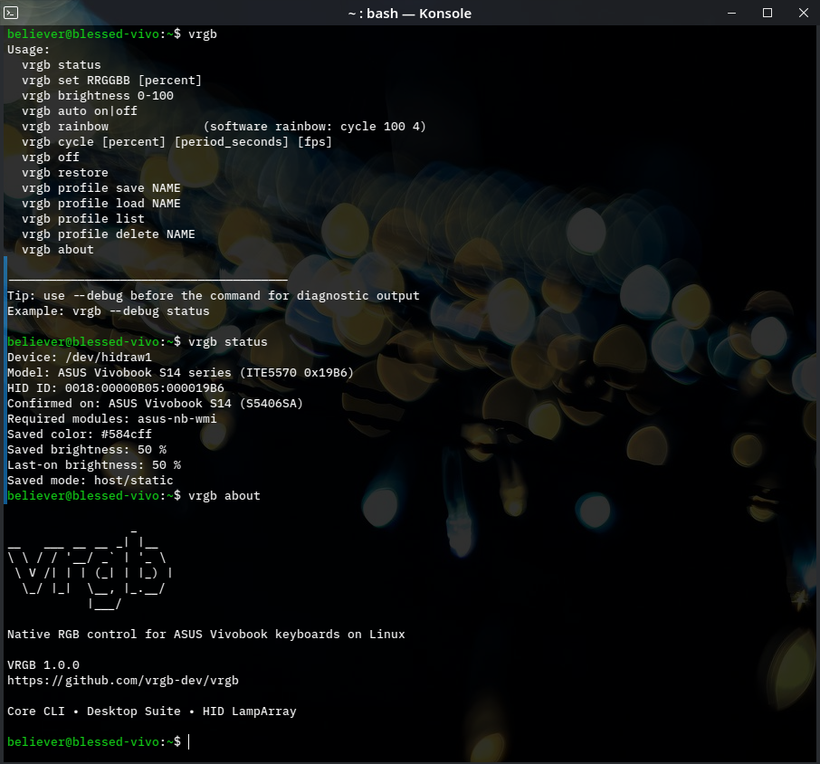

<p align="center">
  
  <br><br>
  <strong>Native RGB control for ASUS Vivobook keyboards on Linux</strong>
  <br>
  Lightweight HID LampArray control with a CLI, optional desktop Suite, profiles, automation, and effects.
  <br><br>
  <a href="https://github.com/vrgb-dev/vrgb/actions/workflows/ci.yml"></a>
  <a href="https://discord.gg/VHtsKyX7VV"></a>
</p>

## Overview

VRGB controls RGB keyboard lighting on supported ASUS Vivobook laptops
that expose a standard HID LampArray interface.

It has two parts:

-   **VRGB Core** --- the `vrgb` command-line tool. A single Python file
    using only the standard library, with no required background daemon.
    Core owns device discovery, HID communication, configuration,
    profiles, effects, and restore behavior.
-   **VRGB Suite** --- an optional PyQt6 desktop frontend built on Core.
    It adds a GUI, system tray controls, live preview, unified
    brightness control, profiles, idle auto-off, daytime automation, and
    desktop integration without duplicating the HID implementation.

VRGB communicates directly with the keyboard controller through Linux
`hidraw`. It does not require a kernel patch, Windows driver, or vendor
RGB utility.

### Why this exists

VRGB started on an ASUS Vivobook S14 running Fedora KDE. Keyboard brightness
worked under Linux, but the RGB backlight was stuck on white and the
usual ASUS lighting tools did not control it.

The keyboard turned out to expose an ITE5570 HID LampArray controller.
VRGB grew from a small command-line tool for that controller into a
community-tested Core + Suite application supporting multiple Vivobook
models.

## Screenshots

<p align="center">
  
</p>

### VRGB Suite

<p align="center">
  
</p>

### VRGB Core

<p align="center">
  
</p>

## Features

### Core

-   Static RGB color control
-   Fine brightness control from 0--100%
-   Software rainbow with saved state and restore support
-   Advanced adjustable color cycle
-   Named profiles
-   Firmware/autonomous lighting mode
-   Persistent configuration
-   Automatic HID LampArray report discovery
-   Verified device mappings with known-good fallback report IDs
-   Debug diagnostics and compatibility reporting
-   Non-root daily use through udev permissions
-   Optional saved-state restore at login
-   Importable Python module for other frontends
-   Standard-library-only Core

### Suite

-   PyQt6 desktop GUI and system tray
-   Color wheel, hex input, preset colors, and live preview
-   Unified keyboard brightness control
-   Hardware Fn brightness synchronization where supported
-   Rainbow toggle in the window and tray
-   Profile save/load/delete
-   Power and firmware-mode controls
-   Idle auto-off with activity wake
-   Optional daytime-off automation using locally calculated
    sunrise/sunset
-   XDG desktop autostart
-   Idle/session integration across GNOME, KDE Plasma, compatible Wayland compositors, and X11

For implementation details, session backends, report discovery, Python
integration, and internal architecture, see
[`TECHNICAL.md`](TECHNICAL.md).

## Supported Hardware

VRGB's **verified hardware support** currently consists of ASUS Vivobook
laptops using the ITE5570 HID LampArray controller. Core can also detect
unverified devices whose HID report descriptors expose the standard
LampArray reports VRGB requires.

Support is based primarily on the HID device and report layout rather
than the laptop's screen size, processor, or marketing name. Verified
mappings record hardware that has been physically tested, while
descriptor discovery can identify compatible-looking LampArray devices
without hard-coding every model.

Matching a known HID ID or exposing the expected LampArray reports does
**not** by itself guarantee compatibility. Some systems may require
model-specific controller initialization or other platform behavior that
a HID descriptor cannot describe. A device is considered verified only
after physical hardware testing.

### Verified mappings

  -------------------------------------------------------------------------------------------
  HID ID                     Confirmed       Firmware report     Color report Notes
                             systems
  -------------------------- -------------- ---------------- ---------------- ---------------
  `0018:00000B05:000019B6`   ASUS Vivobook            `0x0B`           `0x05` Requires
                             S14 S5406SA /                                    `asus-nb-wmi`
                             S5406SA-WH79                                     on the verified
                                                                              mapping

  `0018:00000B05:00005570`   ASUS Vivobook            `0x46`           `0x45` Community
                             S16 M5606K,                                      validated
                             S16 M5606WA,
                             S14 M5406WA
  -------------------------------------------------------------------------------------------

VRGB prefers verified mappings. For other HID LampArray devices, Core can
inspect the HID report descriptor at runtime, discover the required
LampArray report IDs, and expose a matching device as **unverified**.

If your Vivobook exposes a similar controller, run:

``` bash
vrgb --debug status
```

If it works --- or almost works --- please submit a compatibility report
with your laptop model, `HID_ID`, `HID_NAME`, debug output, and the
commands you tested.

Compatibility reports: [Issue
#1](https://github.com/vrgb-dev/vrgb/issues/1)

## Quick Install

Clone the repository and run the installer as your normal user:

``` bash
git clone https://github.com/vrgb-dev/vrgb.git
cd vrgb
chmod +x install.sh
./install.sh
```

The installer asks whether you want:

-   **Core** --- CLI only
-   **Suite** --- Core plus GUI/tray integration and PyQt6

You can also choose directly:

``` bash
./install.sh core
./install.sh suite
```

The installer configures device access so normal VRGB use does not
require root. If group membership is added during installation, log out
and back in before relying on that group access.

Do **not** run the installer itself with `sudo`; it requests elevated
privileges only for the system files that need them.

Then try:

``` bash
vrgb set 00aaff 70
vrgb rainbow
```

## Everyday Usage

### Status

``` bash
vrgb status
```

### Set a color

``` bash
vrgb set RRGGBB [brightness]
```

Example:

``` bash
vrgb set 00aa55 65
```

### Change brightness

``` bash
vrgb brightness 80
```

### Rainbow

``` bash
vrgb rainbow
```

`rainbow` is the simple software effect. It uses full brightness and a
four-second color cycle by default.

For custom brightness, speed, or frame rate:

``` bash
vrgb cycle [brightness] [period_seconds] [fps]
```

Example:

``` bash
vrgb cycle 50 10
```

The active rainbow/cycle is saved as the current mode and can be resumed
by `vrgb restore`. Static commands such as `set`, `auto`, or loading a
profile take over cleanly.

### Profiles

``` bash
vrgb profile save fedorablue
vrgb profile load fedorablue
vrgb profile list
vrgb profile delete fedorablue
```

### Turn lighting off

``` bash
vrgb off
```

### Restore saved state

``` bash
vrgb restore
```

### Firmware/autonomous mode

Let the keyboard firmware control lighting:

``` bash
vrgb auto on
```

Return control to VRGB:

``` bash
vrgb auto off
```

### Debug

``` bash
vrgb --debug status
```

### About

``` bash
vrgb about
```

## VRGB Suite

Install the Suite with:

``` bash
./install.sh suite
```

Launch it from your desktop application menu or run:

``` bash
vrgb-gui
```

The Suite uses Core directly for device and configuration logic. It adds
desktop-friendly controls without maintaining a separate RGB
implementation.

The main window provides color selection, brightness, Rainbow, power,
firmware mode, and profile management. Closing the window leaves VRGB
available in the system tray.

The tray provides quick access to power, Rainbow, brightness, colors,
profiles, and the main window.

### Automation

The Suite can:

-   turn the keyboard off after inactivity and restore it on input;
-   keep lighting off during daytime hours using locally calculated
    sunrise/sunset;
-   restore the saved lighting state when the desktop session starts.

"Start VRGB in the tray at login" uses the standard XDG autostart
mechanism. Sessions or compositors that do not honor XDG autostart can
launch `vrgb-gui --tray` from their own session configuration; an
optional systemd user unit is also provided for compatible sessions.

Tray availability depends on the desktop environment. KDE Plasma and
other StatusNotifierItem-capable panels support it directly; GNOME
generally requires an AppIndicator-style extension. Automation itself
does not depend on a visible tray icon.

Additional desktop/backend details are documented in
[`TECHNICAL.md`](TECHNICAL.md).

## Configuration

VRGB stores user configuration in:

``` text
~/.config/vrgb/config.json
```

This includes the saved lighting state, profiles, effect state, and
Suite settings.

Keyboard lighting may retain its state across a reboot but return to
firmware defaults after a full power cycle. Enabling VRGB startup
restore reapplies the saved state when you log in.

## Troubleshooting

### No compatible keyboard found

Run:

``` bash
vrgb --debug status
```

Check the HID identifiers:

``` bash
grep -H . /sys/class/hidraw/*/device/uevent | grep -E 'HID_ID|HID_NAME'
```

Descriptor discovery can identify compatible-looking LampArray hardware,
but it cannot prove that the laptop initializes or exposes the
controller exactly like a verified system. Include the complete debug
output when reporting an unverified device.

### S5406SA / `0B05:19B6` does not respond

The verified `0018:00000B05:000019B6` mapping requires `asus-nb-wmi`.

Check/load it with:

``` bash
lsmod | grep asus_nb_wmi
sudo modprobe asus-nb-wmi
```

If VRGB works after loading it, the module can be configured to load at
boot:

``` bash
echo asus-nb-wmi | sudo tee /etc/modules-load.d/asus-nb-wmi.conf
```

### Permission denied

Log out and back in after installation if your user was newly added to
the `vrgb` group. You can also reconnect/retrigger the device after the
udev rule is installed.

For deeper diagnostics and implementation details, see
[`TECHNICAL.md`](TECHNICAL.md).

## Uninstall

From the repository:

``` bash
./uninstall.sh
```

Run the uninstaller as your normal user, not with `sudo`. It removes
VRGB's installed Core/Suite files, device-access rule, desktop
integration, and VRGB-created startup entries.

Your personal configuration can be retained or removed according to the
uninstaller's prompts.

## Contributors & Thanks

VRGB began as a small personal compatibility tool and became a broader
project through community code, hardware testing, debugging, and ideas.

Special thanks to:

-   **Matt Warner ([@mrw1986](https://github.com/mrw1986))** --- created
    the original PyQt GUI/tray foundation that became the starting point
    for VRGB Suite.
-   **MikolajQ ([@MikolajQ](https://github.com/MikolajQ))** --- expanded
    the GUI work into the broader Suite architecture and desktop
    integration.
-   **MHS-20 ([@MHS-20](https://github.com/MHS-20))** --- contributed
    software rainbow/cycle support, suspend recovery, startup/restore
    work, dynamic LampArray report discovery, tests/CI, and community
    integration.
-   **Bartolomiv ([@Bartolomiv](https://github.com/Bartolomiv))** ---
    contributed Plasma widget work.
-   **Hardware testing and compatibility research:** `jeffatgit`,
    `rickhg12hs`, `Vtransparent`, `pylandt`, `aryaveersr`, and everyone
    else who submitted hardware reports, tested unsupported systems,
    opened issues, reviewed behavior, or helped identify compatible
    Vivobook models.

Some contributions were later superseded or integrated differently as
the architecture evolved; they are still part of the work that got VRGB
here.

## Contributing

Bug fixes, hardware reports, device mappings, desktop improvements, and
documentation contributions are welcome.

Please read [`CONTRIBUTING.md`](CONTRIBUTING.md) before opening a pull
request. Developers interested in the internals should also read
[`TECHNICAL.md`](TECHNICAL.md).

CI validates tests, Python compilation, version consistency, and install
scripts. Releases are intentionally manual and follow physical
validation on supported hardware.

## Releases and Changelog

See [GitHub
Releases](https://github.com/vrgb-dev/vrgb/releases).

Release tags and GitHub releases are created deliberately after
validation; passing CI does not automatically publish a release.

## License

VRGB is released under the [MIT License](LICENSE).

## Repository

https://github.com/vrgb-dev/vrgb
