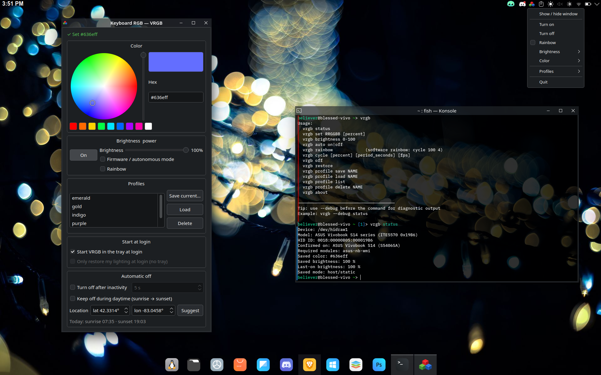

   
   
  RGB control for ASUS Vivobook HID LampArray keyboards on Linux 
   
  

## Overview

VRGB is a lightweight Linux CLI utility for controlling RGB keyboards on
Vivobook ASUS laptops that expose the HID LampArray interface.

It comes in two parts:

- **VRGB Core** — the `vrgb` command line tool. A single Python file, standard
  library only, no daemon. It is also an importable module for other frontends.
- **VRGB Suite** (optional) — a PyQt6 GUI and tray on top of Core, with desktop
  integration and automation (idle auto-off, daytime-off). It lives in `suite/`
  and never changes how Core works.

**Why this exists:**

I bought a Vivobook S14 and put Fedora on it for school and work. Fn brightness worked, but the keyboard was stuck on white and none of the usual ASUS RGB tools did anything. After digging into it, I found the keyboard wasn’t using the typical ASUS control path at all.

VRGB is just a tool built around that discovery to get simple RGB control working on Linux without touching the kernel or running a daemon.

 

**The project was developed and validated on:**

ITE5570 (HID_ID: 0018:00000B05:000019B6)  
- ASUS Vivobook S14 series (S5406SA / S5406SA-WH79)  
- firmware: 0x0B  
- color: 0x05  
- note: some 0x19B6 systems may require `asus-nb-wmi` to be loaded before HID control works  

**Community validated:**

ITE5570 (HID_ID: 0018:00000B05:00005570)  
- ASUS Vivobook S series  
- confirmed on S16 M5606K, S16 M5606WA, and S14 M5406WA  
- firmware: 0x46  
- color: 0x45  

 

Unlike some RGB tools, VRGB does not rely on kernel patches, vendor utilities, background daemons, controller hacks, or reverse-engineered Windows drivers. VRGB simply communicates with the keyboard controller through the Linux HID subsystem. 

 

**Control path:**

    vrgb.py
       ↓
    /dev/hidrawX
       ↓
    ITE5570 keyboard controller
       ↓
    RGB lighting

Current Stable Release: see [Releases](https://github.com/vrgb-dev/vrgb/releases)
    

## Example Usage

  

## Features

-   Rainbow mode with adjustable speed and brightness, resumed after logout and reboot
-   Static RGB color control
-   Fine brightness scaling (0–100%)
-   Custom profiles
-   Firmware autonomous mode toggle
-   OEM firmware rainbow (deprecated; sudo required, model-dependent)
-   Debug diagnostics
-   Required module checks for affected devices
-   Persistent configuration
-   Installer and uninstaller included
-   Non-root daily usage via udev permissions
-   Optional KDE autostart restore
-   Optional systemd user autostart restore (any desktop environment)

## Supported Hardware

VRGB supports ASUS laptops that expose the **ITE5570 HID LampArray controller**.

Support is based on **verified device mappings**, not specific laptop models. Some ASUS laptops share the same HID controller and report IDs across different screen sizes and CPU platforms.

The firmware and color report IDs are the standard HID LampArray `LampArrayControlReport` and `LampRangeUpdateReport`. VRGB reads them from the device's HID report descriptor at runtime; the IDs listed below are what the verified devices declare, and are used as a fallback if the descriptor cannot be read.

### Verified mappings

**ITE5570 (HID_ID: 0018:00000B05:000019B6)**  
- confirmed on: ASUS Vivobook S14 series (S5406SA / S5406SA-WH79)  
- firmware report: `0x0B`  
- color report: `0x05`
- required module: `asus-nb-wmi`

**ITE5570 (HID_ID: 0018:00000B05:00005570)**  
- confirmed on:
  - ASUS Vivobook S16 (M5606K)
  - ASUS Vivobook S16 (M5606WA)
  - ASUS Vivobook S14 (M5406WA)
- firmware report: `0x46`  
- color report: `0x45`  

### Example device identifiers

    HID_NAME=ITE5570:00 0B05:19B6
    HID_ID=0018:00000B05:000019B6

    HID_NAME=ITE5570:00 0B05:5570
    HID_ID=0018:00000B05:00005570

## Compatibility

VRGB scans available `hidraw` devices and selects compatible ASUS keyboard controllers automatically. Verified devices are preferred. Any other device whose HID report descriptor declares a LampArray (usage page `0x59`) is also detected and controlled through its standard reports, lighting all of its lamps with one color; `vrgb status` marks it as unverified.

Multiple ASUS laptops appear to share the same ITE5570 controller and HID LampArray protocol. If your system exposes a similar device, there is a strong chance VRGB will work.

Support expands through **verified device mappings** as new hardware is tested: a verified mapping adds known models and required kernel modules, which a descriptor cannot describe. Stability and correctness are prioritized over broad but unreliable compatibility.

### Required modules

Some ITE5570 systems may ignore HID LampArray commands until the ASUS WMI module has initialized the hardware.

For affected mappings, VRGB checks whether the required module is loaded and prints clear instructions if it is missing.

Example manual load:

    sudo modprobe asus-nb-wmi

Example load at boot:

    echo asus-nb-wmi | sudo tee /etc/modules-load.d/asus-nb-wmi.conf

If VRGB works (or does not work) on your system, please submit a compatibility report including:

    vrgb --debug status

Community reports help identify new supported devices quickly.

See reports here:  
https://github.com/vrgb-dev/vrgb/issues/1

## Quick Install

Clone the repository and run the installer. It asks whether to install
**Core** (CLI only) or **Suite** (Core + GUI/tray, needs PyQt6); pass `core` or
`suite` to skip the question.

    git clone https://github.com/vrgb-dev/vrgb.git
    cd vrgb
    chmod +x install.sh
    ./install.sh            # or: ./install.sh core | ./install.sh suite

The udev rule gives the logged-in user access to the keyboard right away
(`uaccess`); membership in the `vrgb` group applies after the next login.

Then pick a color, or start the rainbow:

    vrgb set 00aaff 70
    vrgb rainbow

**Note:**
Keyboard color persists on reboot, but may reset to firmware default after a full power cycle.
Use the installer's autostart option (or set it manually) to reapply your configuration automatically.

## VRGB Suite (GUI, tray and automation)

The Suite is a PyQt6 frontend over Core: it imports `vrgb` as a module and drives
the keyboard in-process, so the HID protocol and config logic stay in Core — no
duplicated device code. Original GUI by Matt Warner
([@mrw1986](https://github.com/mrw1986)).

**Features**

- HS color wheel + value slider, hex entry, and preset swatches
- Live preview while you drag (throttled), persisted on release
- Unified brightness slider (0–100%) that is **tied to the FN+F4 / FN+F3 keys**: it
  decomposes brightness into the firmware backlight step (`asus::kbd_backlight`, set
  via logind) and vrgb's HID intensity so the two layers never double-dim, and it
  follows the firmware level (via the kernel's `brightness_hw_changed` notification,
  polling only while the window is open) so the hardware keys move the slider too.
  Falls back to pure-HID brightness if the LED node / logind is unavailable.
- A **Rainbow** toggle (window and tray) that runs `vrgb rainbow`: it keeps running
  after the window closes, comes back after logout/reboot, and follows the
  brightness slider. Picking a color switches back to that static color.
- A power on/off toggle and firmware/autonomous mode toggle
- Profile manager (save / load / delete)
- System-tray applet: on/off, Rainbow, a Brightness submenu, a Color submenu (preset
  swatches + a "More colors…" dialog), and profile loading; closing the window
  hides it to the tray. (Submenus rather than embedded widgets, because KDE renders
  tray menus over DBusMenu, which does not support embedded widgets.)
- **Turn off after inactivity** — the backlight returns on the next key/mouse
  input. Only the live HID intensity changes; the saved brightness stays. It is
  paused while the rainbow is on.
  Idle detection is picked automatically:

  | Session | Backend |
  |---|---|
  | GNOME | Mutter IdleMonitor (D-Bus, event-driven) |
  | KDE Plasma (Wayland), sway, Hyprland, labwc / wayfire (LXQt), niri, COSMIC | Wayland `ext-idle-notify-v1` (event-driven, no extra dependencies) |
  | X11 sessions (LXQt, XFCE, KDE X11, …) | XScreenSaver extension (`libXss`); checks only when the timeout could have passed |

- **Keep off during daytime** — between sunrise and sunset at the configured
  location the backlight is switched off; it comes back at sunset if it was on.
  Sun times are computed locally (no network); the location is suggested offline
  from the system timezone's reference city (e.g. `Europe/Warsaw` → Warsaw).
- **Session start** — started at login (`vrgb-gui --tray`), it restores your
  lighting, or keeps it off if it is daytime and daytime-off is on.
- Falls back to a Polkit (`pkexec`) password prompt if the keyboard is not
  accessible in your session; it only ever runs the root-owned system `vrgb`.

**Running it on every desktop**

- Started from a terminal, `vrgb-gui` moves itself to the background and gives the
  shell back; closing the window leaves it running in the tray.
  `vrgb-gui --foreground` keeps it attached to the terminal (Ctrl+C stops it).
- Only one copy runs: starting `vrgb-gui` again opens the window of the running
  one; `vrgb-gui --quit` or the tray menu's Quit stops it.
- `vrgb-gui --tray` keeps running in the background even without a system tray
  (e.g. sway without a bar), so the automation still works.
- Login autostart: "Start VRGB in the tray at login" writes an XDG autostart entry
  (GNOME, KDE, LXQt, XFCE, Cinnamon, …). On compositors without XDG autostart
  (sway, Hyprland, …) add `exec vrgb-gui --tray` to the compositor config, or — if
  your session starts `graphical-session.target` (e.g. via uwsm) — enable the user
  unit: `systemctl --user enable --now vrgb-gui.service`.
- The tray icon needs a StatusNotifierItem host (KDE/LXQt/XFCE panels, waybar's
  `tray` module, or the AppIndicator extension on GNOME).

**Layout**

    suite/vrgb_suite/   app.py (window, tray, entry point), worker.py (device I/O
                        thread), idle.py, sun.py, system.py, widgets.py, core.py
    suite/data/         .desktop launcher and systemd user unit
    suite/pyproject.toml  for distro packages (package and command `vrgb-gui`)

Run from a checkout without installing: `PYTHONPATH=.:suite python3 -m vrgb_suite`.

## Command List

Show Current Status

    vrgb status

Set RGB Color

    vrgb set RRGGBB [brightness %]

*Example:*

    vrgb set 00aa55 65

Change Brightness

    vrgb brightness 80

Rainbow

    vrgb rainbow

Full brightness, one full color spectrum every 4 seconds: a shortcut for
`vrgb cycle 100 4`. For other settings:

    vrgb cycle [percent] [period_seconds] [fps]

*Example (half brightness, a slower 10-second spectrum):*

    vrgb cycle 50 10

The rainbow is saved as the current mode, so `vrgb restore` (and the autostart
restore options below) resume it after a logout or reboot. When the systemd
restore service is enabled, `vrgb rainbow` and `vrgb cycle` hand it to the
service and return immediately; otherwise they run in the foreground.

While it runs, other commands take over cleanly: `set`, `auto` or loading a
profile stop the rainbow and replace it, `brightness` changes its brightness, and
`off` pauses it until the next `restore`. Pressing Ctrl+C stops it and it is not
resumed at the next login.
    
Save Profile (Current State)

    vrgb profile save fedorablue
    
Load Profile

    vrgb profile load fedorablue
    
Delete Profile

    vrgb profile delete fedorablue
    
List Saved Profiles

    vrgb profile list

Turn Lighting Off

    vrgb off

Restore Saved State

    vrgb restore

If the saved mode is the rainbow, `restore` resumes it and keeps
running until another command takes over.

Enable firmware lighting (Firmware Autonomous Mode)

    vrgb auto on

Return control to VRGB:

    vrgb auto off

Debug Mode

    vrgb --debug status

About

    vrgb about

Deprecated: OEM Firmware Rainbow (requires sudo, model-dependent)

    sudo vrgb rainbow-oem on
    sudo vrgb rainbow-oem off

Switches the keyboard to its built-in firmware animation through the ASUS WMI
debug interface. It only works on some models and offers no speed or color
control; prefer `vrgb rainbow`. The older spelling `vrgb rainbow on|off` is an
alias.

## Using vrgb as a library

`vrgb.py` is both the CLI and a plain Python module (standard library only), so
frontends can reuse the HID protocol and config handling instead of copying them:

    import vrgb

    dev = vrgb.find_device()                 # dict: path, model, report ids, …
    cfg = vrgb.load_config()
    vrgb.cmd_set(cfg, dev, "00aaff", 70)     # same as `vrgb set 00aaff 70`
    vrgb.set_color(dev, 255, 0, 0, vrgb.percent_to_intensity(40))  # live, not saved

The `cmd_*` functions behave like the matching CLI commands (they update and
save `~/.config/vrgb/config.json`); `set_color` / `set_firmware_mode` only talk
to the device. `save_config` writes atomically and keeps keys it does not know,
so a frontend may store its own settings in the same file.

Distro packages install the module (`pyproject.toml`); `./install.sh` keeps
installing the single file to `/usr/local/bin/vrgb`.

## Manual Installation

Install Binary

    sudo install -m 755 vrgb.py /usr/local/bin/vrgb

Create Access Group

    sudo groupadd -f vrgb
    sudo usermod -aG vrgb $USER

Install udev Rule

Create:

    /etc/udev/rules.d/99-vrgb.rules

Contents:

    SUBSYSTEM=="hidraw", KERNELS=="i2c-ITE5570*", MODE="0660", GROUP="vrgb"

Reload udev

    sudo udevadm control --reload-rules
    sudo udevadm trigger

Log out and log back in afterward.

## Optional KDE Autostart Restore

Create:

    ~/.config/autostart/vrgb.desktop

Contents:

    [Desktop Entry]
    Type=Application
    Exec=/usr/local/bin/vrgb restore
    Hidden=false
    NoDisplay=false
    X-GNOME-Autostart-enabled=true
    Name=VRGB Restore
    Comment=Restore keyboard RGB state

## Optional systemd Autostart Restore (any desktop environment)

The KDE autostart option above relies on the XDG autostart spec, which not
every window manager or compositor honors (tiling WMs such as Hyprland or
Sway, for example). A systemd `--user` unit works the same way regardless
of desktop environment, and the installer can set it up for you.

Manual install:

    mkdir -p ~/.config/systemd/user
    install -m 644 systemd/vrgb-restore.service ~/.config/systemd/user/vrgb-restore.service
    systemctl --user daemon-reload
    systemctl --user enable vrgb-restore.service

Contents of `systemd/vrgb-restore.service`:

    [Unit]
    Description=Restore VRGB keyboard lighting state
    After=graphical-session.target

    [Service]
    Type=exec
    ExecStart=/usr/local/bin/vrgb restore
    Restart=on-failure
    RestartSec=2

    [Install]
    WantedBy=graphical-session.target

The unit runs `vrgb restore` at the start of your graphical session, so it will
apply from your next login onward. A static restore exits right away; a saved
rainbow keeps the service running for the session.

You can install both the KDE and systemd autostart options at once if you
like; they do the same thing and won't conflict (if both resume a cycle, the
later one takes over and the other exits).

## Uninstall

    ./uninstall.sh

Removes:

-   /usr/local/bin/vrgb
-   the udev rule
-   optional KDE and/or systemd autostart entries

## Future Development

- expanded ASUS hardware compatibility
- ~~simple GUI frontend~~ — added (`vrgb-gui`, PyQt6)
- ~~color picker / brightness control~~ — added
- ~~profile management~~ — added (CLI + GUI)
- packaged distribution (RPM / Flatpak)

With future updates in mind, this project will aim to continue to be as efficient and lightweight as possible.

## Changelog

Release notes are generated from commit messages and published on [GitHub Releases](https://github.com/vrgb-dev/vrgb/releases).

## Contributing

See [CONTRIBUTING.md](CONTRIBUTING.md).

## License

MIT License

## Repository

https://github.com/vrgb-dev/vrgb
